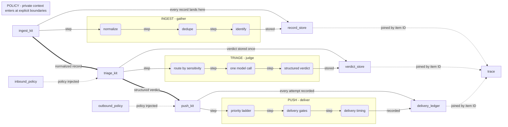

# Amanuensis-architecture - architecture diagram (data)

Auto-generated from the canvas source of truth. Do not edit by hand;
edit the `.canvas` and regenerate (`npm run diagram:doc`).

- layers: 4 - nodes: 18 (high-level 9 / detail 9) - edges: 22

## Layers

| layer | label | nodes |
|---|---|---|
| POLICY | POLICY - private context enters at explicit boundaries |  |
| INGEST | INGEST - gather | d-normalize, d-dedupe, d-identify |
| TRIAGE | TRIAGE - judge | d-route, d-call, d-verdict |
| PUSH | PUSH - deliver | d-ladder, d-gates, d-fold |

## Nodes

| id | layer | lod | block | type | title | detail |
|---|---|---|---|---|---|---|
| `inbound-policy` | L4 | high-level | none | gate | inbound policy gate | selects the allowed model route |
| `outbound-policy` | L4 | high-level | none | gate | outbound audience gate | audience and sensitivity, fail closed |
| `ingest-kit` | L1 | high-level | none | process | ingest-kit | make sources comparable |
| `triage-kit` | L1 | high-level | none | process | triage-kit | turn a record into a decision |
| `push-kit` | L1 | high-level | none | process | push-kit | spend attention deliberately |
| `d-normalize` | INGEST | detail | none | process | normalize | one record shape for every source |
| `d-dedupe` | INGEST | detail | none | process | dedupe | content hashing drops repeats |
| `d-identify` | INGEST | detail | none | process | identify | assigns the stable item ID |
| `d-route` | TRIAGE | detail | none | process | route by sensitivity | sensitive items go local-only |
| `d-call` | TRIAGE | detail | none | process | one model call | constrained decoding, no invalid priority |
| `d-verdict` | TRIAGE | detail | none | process | structured verdict | priority, audience, summary, action required |
| `d-ladder` | PUSH | detail | none | process | priority ladder | must, should, fyi, ambient, drop |
| `d-gates` | PUSH | detail | none | process | delivery gates | read persisted values, fail closed |
| `d-fold` | PUSH | detail | none | process | delivery timing | deferred items age upward |
| `record-store` | L2 | high-level | entity | store | record store | content-hashed |
| `verdict-store` | L2 | high-level | entity | store | verdict store | versioned by route |
| `delivery-ledger` | L2 | high-level | entity | store | delivery ledger | each delivery and its outcome |
| `trace` | L2 | high-level | entity | store | stable item ID | one trace connects every decision |

## Edges

| from | to | kind | shown at |
|---|---|---|---|
| `ingest-kit` | `triage-kit` | authority (normalized record) | high-level |
| `triage-kit` | `push-kit` | authority (structured verdict) | high-level |
| `inbound-policy` | `triage-kit` | async (policy injected) | high-level |
| `outbound-policy` | `push-kit` | async (policy injected) | high-level |
| `ingest-kit` | `record-store` | data (every record lands here) | high-level |
| `triage-kit` | `verdict-store` | data (verdict stored once) | high-level |
| `push-kit` | `delivery-ledger` | data (every attempt recorded) | high-level |
| `ingest-kit` | `d-normalize` | data (step) | detail |
| `d-normalize` | `d-dedupe` | data (step) | detail |
| `d-dedupe` | `d-identify` | data (step) | detail |
| `d-identify` | `record-store` | data (stored) | detail |
| `triage-kit` | `d-route` | data (step) | detail |
| `d-route` | `d-call` | data (step) | detail |
| `d-call` | `d-verdict` | data (step) | detail |
| `d-verdict` | `verdict-store` | data (stored) | detail |
| `push-kit` | `d-ladder` | data (step) | detail |
| `d-ladder` | `d-gates` | data (step) | detail |
| `d-gates` | `d-fold` | data (step) | detail |
| `d-fold` | `delivery-ledger` | data (recorded) | detail |
| `record-store` | `trace` | async (joined by item ID) | high-level |
| `verdict-store` | `trace` | async (joined by item ID) | high-level |
| `delivery-ledger` | `trace` | async (joined by item ID) | high-level |

## Reading levels

**High-level (level 0):** summary nodes plus cross-layer edges - the authored composition.

- L4 `inbound-policy` - inbound policy gate
- L4 `outbound-policy` - outbound audience gate
- L1 `ingest-kit` - ingest-kit
- L1 `triage-kit` - triage-kit
- L1 `push-kit` - push-kit
- L2 `record-store` - record store
- L2 `verdict-store` - verdict store
- L2 `delivery-ledger` - delivery ledger
- L2 `trace` - stable item ID

**Per-layer detail (level 1):** drilling into a layer reveals its internal nodes.

- **INGEST** INGEST - gather: d-normalize -> d-dedupe; d-dedupe -> d-identify
- **TRIAGE** TRIAGE - judge: d-route -> d-call; d-call -> d-verdict
- **PUSH** PUSH - deliver: d-ladder -> d-gates; d-gates -> d-fold

## Edge kinds

| kind | meaning |
|---|---|
| authority | thick (authority transition) |
| async | dashed (trace / background) |
| data | solid + arrow (deterministic data / control) |

## Acceptance graph (derived)

Structure only (auto-layout); the presentation figure composes these
nodes deliberately.

