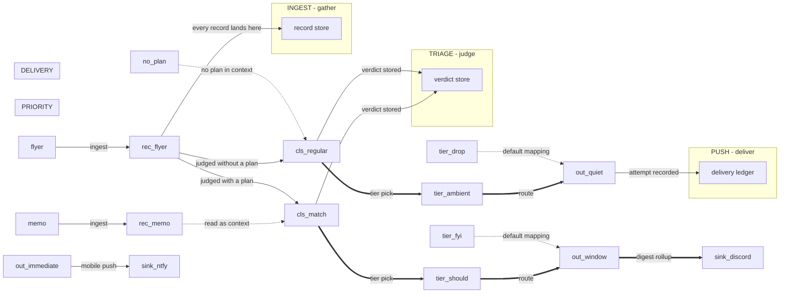

# Amanuensis-example - architecture diagram (data)

Auto-generated from the canvas source of truth. Do not edit by hand;
edit the `.canvas` and regenerate (`npm run diagram:doc`).

- layers: 5 - nodes: 20 (high-level 17 / detail 3) - edges: 18

## Layers

| layer | label | nodes |
|---|---|---|
| INGEST | INGEST - gather | record-store |
| TRIAGE | TRIAGE - judge | verdict-store |
| PUSH | PUSH - deliver | ledger |
| PRIORITY | PRIORITY |  |
| DELIVERY | DELIVERY |  |

## Nodes

| id | layer | lod | block | type | title | detail |
|---|---|---|---|---|---|---|
| `memo` | L2 | high-level | none | process | memo | replace my desk chair this month |
| `flyer` | L2 | high-level | none | process | flyer email | 20% off ergonomic chairs |
| `rec-memo` | L2 | high-level | entity | store | normalized record |  |
| `rec-flyer` | L2 | high-level | entity | store | normalized record |  |
| `record-store` | INGEST | detail | entity | store | record store | content-hashed, versioned |
| `cls-match` | L1 | high-level | none | process | marketing message | matching a recent purchase plan |
| `cls-regular` | L0 | high-level | none | process | regular marketing message | no plan in context |
| `no-plan` | L0 | high-level | none | process | no matching plan |  |
| `verdict-store` | TRIAGE | detail | entity | store | verdict store | versioned by route |
| `tier-must` | L2 | high-level | none | process | must |  |
| `tier-should` | L1 | high-level | none | process | should |  |
| `tier-fyi` | L2 | high-level | none | process | fyi |  |
| `tier-ambient` | L0 | high-level | none | process | ambient |  |
| `tier-drop` | L2 | high-level | none | process | drop |  |
| `out-immediate` | L2 | high-level | none | process | immediate |  |
| `out-window` | L1 | high-level | none | process | next window |  |
| `out-quiet` | L0 | high-level | none | process | quiet - do not disturb | nothing sent; held, browsable later |
| `sink-ntfy` | L2 | high-level | none | process | ntfy.sh |  |
| `sink-discord` | L1 | high-level | none | process | discord channel |  |
| `ledger` | PUSH | detail | entity | store | delivery ledger | every attempt lands here |

## Edges

| from | to | kind | shown at |
|---|---|---|---|
| `memo` | `rec-memo` | data (ingest) | high-level |
| `flyer` | `rec-flyer` | data (ingest) | high-level |
| `rec-flyer` | `record-store` | data (every record lands here) | detail |
| `rec-memo` | `cls-match` | async (read as context) | high-level |
| `rec-flyer` | `cls-match` | data (judged with a plan) | high-level |
| `rec-flyer` | `cls-regular` | data (judged without a plan) | high-level |
| `no-plan` | `cls-regular` | async (no plan in context) | high-level |
| `cls-match` | `tier-should` | authority (tier pick) | high-level |
| `cls-regular` | `tier-ambient` | authority (tier pick) | high-level |
| `tier-should` | `out-window` | authority (route) | high-level |
| `tier-ambient` | `out-quiet` | authority (route) | high-level |
| `tier-fyi` | `out-window` | async (default mapping) | high-level |
| `tier-drop` | `out-quiet` | async (default mapping) | high-level |
| `out-immediate` | `sink-ntfy` | data (mobile push) | high-level |
| `out-window` | `sink-discord` | authority (digest rollup) | high-level |
| `cls-match` | `verdict-store` | data (verdict stored) | detail |
| `cls-regular` | `verdict-store` | data (verdict stored) | detail |
| `out-quiet` | `ledger` | data (attempt recorded) | detail |

## Reading levels

**High-level (level 0):** summary nodes plus cross-layer edges - the authored composition.

- L2 `memo` - memo
- L2 `flyer` - flyer email
- L2 `rec-memo` - normalized record
- L2 `rec-flyer` - normalized record
- L1 `cls-match` - marketing message
- L0 `cls-regular` - regular marketing message
- L0 `no-plan` - no matching plan
- L2 `tier-must` - must
- L1 `tier-should` - should
- L2 `tier-fyi` - fyi
- L0 `tier-ambient` - ambient
- L2 `tier-drop` - drop
- L2 `out-immediate` - immediate
- L1 `out-window` - next window
- L0 `out-quiet` - quiet - do not disturb
- L2 `sink-ntfy` - ntfy.sh
- L1 `sink-discord` - discord channel

**Per-layer detail (level 1):** drilling into a layer reveals its internal nodes.

- **INGEST** INGEST - gather: record-store
- **TRIAGE** TRIAGE - judge: verdict-store
- **PUSH** PUSH - deliver: ledger

## Edge kinds

| kind | meaning |
|---|---|
| data | solid + arrow (deterministic data / control) |
| async | dashed (trace / background) |
| authority | thick (authority transition) |

## Acceptance graph (derived)

Structure only (auto-layout); the presentation figure composes these
nodes deliberately.

