# Yaaa - architecture diagram (data)

Auto-generated from the canvas source of truth. Do not edit by hand;
edit the `.canvas` and regenerate (`npm run diagram:doc`).

- layers: 6 - nodes: 33 (high-level 10 / detail 23) - edges: 44

## Layers

| layer | label | nodes |
|---|---|---|
| L0 | L0 - IO boundary | passive-input, proactive-input, passive-output, proactive-output |
| L1 | L1 - SENSE | sense, source-adapters, normalize, source-records |
| L2 | L2 - Binding layer | memory-ssot, policy-router, harness-memory, agent-memory, converse |
| L3 | L3 - Bounded ReAct | react-loop, reason, act, observe, reflect |
| L4 | L4 - Gated action | fail-closed-gate, side-effect-intent, procedure-manifest, policy-check, action-disposition |
| L5 | L5 - Governance foundation | governance, run-traces, extract, distill, review, promote, memory-reconciliation, deploy, adr-changelog, runbook-updates |

## Nodes

| id | layer | lod | block | type | title | detail |
|---|---|---|---|---|---|---|
| `passive-input` | L0 | high-level | entity | store | passive input | RSS, feeds, timers |
| `proactive-input` | L0 | high-level | entity | store | proactive input | operator turn / approval |
| `passive-output` | L0 | high-level | entity | store | passive output | inbox / trace view |
| `proactive-output` | L0 | high-level | action | process | proactive output | push / ask / alert |
| `sense` | L1 | high-level | workflow | process | SENSE | source records in |
| `source-adapters` | L1 | detail | workflow | process | source adapters | feeds, docs, events |
| `normalize` | L1 | detail | workflow | process | normalize | parse, classify |
| `source-records` | L1 | detail | entity | store | source records | operator-owned copy |
| `memory-ssot` | L2 | high-level | entity | store | memory SSoT | git-backed authority |
| `policy-router` | L2 | detail | workflow | process | policy router | mode/model/tool routing |
| `harness-memory` | L2 | detail | entity | store | harness memory | rebuildable projection |
| `agent-memory` | L2 | detail | entity | store | agent memory | staged namespace |
| `converse` | L2 | high-level | workflow | process | converse | replaceable session harness |
| `react-loop` | L3 | high-level | workflow | process | ReAct task loop | called with context |
| `reason` | L3 | detail | workflow | process | reason | plan next step |
| `act` | L3 | detail | action | process | act | intent proposal only |
| `observe` | L3 | detail | workflow | process | observe | result / trace |
| `reflect` | L3 | detail | workflow | process | reflect | task-local adjust |
| `fail-closed-gate` | L4 | high-level | control | gate | fail-closed gate | default deny |
| `side-effect-intent` | L4 | detail | entity | store | side-effect intent | proposal, not authority |
| `procedure-manifest` | L4 | detail | entity | store | procedure manifest | versioned write plan |
| `policy-check` | L4 | detail | control | decision | policy check | mode + permission |
| `action-disposition` | L4 | detail | action | process | approve / refuse / defer | run, stop, or hold |
| `governance` | L5 | high-level | control | process | governance meta-loop | authority change review |
| `run-traces` | L5 | detail | entity | store | run traces | what happened |
| `extract` | L5 | detail | workflow | process | extract | candidates |
| `distill` | L5 | detail | workflow | process | distill | structured artifact |
| `review` | L5 | detail | control | decision | human review | approve / reject |
| `promote` | L5 | detail | action | process | promote | approved change |
| `memory-reconciliation` | L5 | detail | workflow | process | memory reconciliation | reviewed namespace alignment |
| `deploy` | L5 | detail | action | process | apply | reviewed runtime behavior |
| `adr-changelog` | L5 | detail | entity | store | ADR changelog | decision history |
| `runbook-updates` | L5 | detail | entity | store | runbook updates | SOP + rollback |

## Edges

| from | to | kind | shown at |
|---|---|---|---|
| `passive-input` | `sense` | data (ambient ingest) | high-level |
| `sense` | `memory-ssot` | data (binding candidate) | high-level |
| `memory-ssot` | `react-loop` | data (governed context) | high-level |
| `react-loop` | `fail-closed-gate` | async (requests write) | high-level |
| `fail-closed-gate` | `governance` | async (trace) | high-level |
| `governance` | `memory-ssot` | authority (reviewed memory delta) | high-level |
| `converse` | `passive-output` | data (surface state) | high-level |
| `converse` | `proactive-output` | data (ask/alert/result) | high-level |
| `fail-closed-gate` | `proactive-output` | data (disposition output) | high-level |
| `proactive-input` | `converse` | data (operator turn) | high-level |
| `passive-input` | `source-adapters` | data | detail |
| `source-adapters` | `normalize` | data | detail |
| `normalize` | `source-records` | data | detail |
| `source-records` | `sense` | data | detail |
| `policy-router` | `converse` | data (mode/model/tool route) | detail |
| `memory-ssot` | `harness-memory` | data (materialize projection) | detail |
| `converse` | `react-loop` | data (routed task) | high-level |
| `harness-memory` | `agent-memory` | data (scoped namespace) | detail |
| `agent-memory` | `converse` | sync | detail |
| `harness-memory` | `react-loop` | data (served context) | detail |
| `react-loop` | `reason` | data (expand) | detail |
| `reason` | `act` | data | detail |
| `act` | `observe` | data | detail |
| `observe` | `reflect` | data | detail |
| `reflect` | `reason` | data (loop) | detail |
| `act` | `side-effect-intent` | data (intent proposal) | detail |
| `side-effect-intent` | `procedure-manifest` | funnel | detail |
| `procedure-manifest` | `policy-check` | funnel | detail |
| `policy-check` | `fail-closed-gate` | data | detail |
| `fail-closed-gate` | `action-disposition` | data (disposition) | detail |
| `action-disposition` | `proactive-output` | data (surface disposition) | detail |
| `governance` | `run-traces` | data (expand) | detail |
| `run-traces` | `extract` | data | detail |
| `extract` | `distill` | data | detail |
| `distill` | `review` | data | detail |
| `review` | `promote` | authority | detail |
| `promote` | `memory-reconciliation` | authority | detail |
| `memory-reconciliation` | `deploy` | data | detail |
| `promote` | `adr-changelog` | data (record) | detail |
| `memory-reconciliation` | `runbook-updates` | data (harden) | detail |
| `adr-changelog` | `runbook-updates` | data (informs) | detail |
| `runbook-updates` | `deploy` | data | detail |
| `memory-reconciliation` | `memory-ssot` | authority (reviewed alignment) | detail |
| `agent-memory` | `memory-reconciliation` | async (staged delta) | detail |

## Reading levels

**High-level (level 0):** summary nodes plus cross-layer edges - a layered map with L0/L5 bands and an L4 write funnel.

- L0 `passive-input` - passive input
- L0 `proactive-input` - proactive input
- L0 `passive-output` - passive output
- L0 `proactive-output` - proactive output
- L1 `sense` - SENSE
- L2 `memory-ssot` - memory SSoT
- L2 `converse` - converse
- L3 `react-loop` - ReAct task loop
- L4 `fail-closed-gate` - fail-closed gate
- L5 `governance` - governance meta-loop

**Per-layer detail (level 1):** drilling into a layer reveals its internal nodes.

- **L1** L1 - SENSE: source-adapters -> normalize; normalize -> source-records; source-records -> sense
- **L2** L2 - Binding layer: policy-router -> converse; memory-ssot -> harness-memory; harness-memory -> agent-memory; agent-memory -> converse
- **L3** L3 - Bounded ReAct: react-loop -> reason; reason -> act; act -> observe; observe -> reflect; reflect -> reason
- **L4** L4 - Gated action: side-effect-intent -> procedure-manifest; procedure-manifest -> policy-check; policy-check -> fail-closed-gate; fail-closed-gate -> action-disposition
- **L5** L5 - Governance foundation: governance -> run-traces; run-traces -> extract; extract -> distill; distill -> review; review -> promote; promote -> memory-reconciliation; memory-reconciliation -> deploy; promote -> adr-changelog; memory-reconciliation -> runbook-updates; adr-changelog -> runbook-updates; runbook-updates -> deploy

## Edge kinds

| kind | meaning |
|---|---|
| data | solid + arrow (deterministic data / control) |
| async | dashed (trace / background) |
| authority | thick (authority transition) |
| sync | double arrow (negotiated state) |
| funnel | constrained write path before a gate |

## Acceptance graph (derived)

Structure only (auto-layout); the presentation figure composes these
nodes deliberately.

```mermaid
flowchart LR
  subgraph grp_l0 ["L0 - IO boundary"]
    passive_input["passive input"]
    proactive_input["proactive input"]
    passive_output["passive output"]
    proactive_output("proactive output")
  end
  subgraph grp_l1 ["L1 - SENSE"]
    sense("SENSE")
    source_adapters("source adapters")
    normalize("normalize")
    source_records["source records"]
  end
  subgraph grp_l2 ["L2 - Binding layer"]
    memory_ssot["memory SSoT"]
    policy_router("policy router")
    harness_memory["harness memory"]
    agent_memory["agent memory"]
    converse("converse")
  end
  subgraph grp_l3 ["L3 - Bounded ReAct"]
    react_loop("ReAct task loop")
    reason("reason")
    act("act")
    observe("observe")
    reflect("reflect")
  end
  subgraph grp_l4 ["L4 - Gated action"]
    fail_closed_gate{{"fail-closed gate"}}
    side_effect_intent["side-effect intent"]
    procedure_manifest["procedure manifest"]
    policy_check{"policy check"}
    action_disposition("approve / refuse / defer")
  end
  subgraph grp_l5 ["L5 - Governance foundation"]
    governance("governance meta-loop")
    run_traces["run traces"]
    extract("extract")
    distill("distill")
    review{"human review"}
    promote("promote")
    memory_reconciliation("memory reconciliation")
    deploy("apply")
    adr_changelog["ADR changelog"]
    runbook_updates["runbook updates"]
  end

  passive_input -->|ambient ingest| sense
  sense -->|binding candidate| memory_ssot
  memory_ssot -->|governed context| react_loop
  react_loop -.->|requests write| fail_closed_gate
  fail_closed_gate -.->|trace| governance
  governance ==>|reviewed memory delta| memory_ssot
  converse -->|surface state| passive_output
  converse -->|ask/alert/result| proactive_output
  fail_closed_gate -->|disposition output| proactive_output
  proactive_input -->|operator turn| converse
  passive_input --> source_adapters
  source_adapters --> normalize
  normalize --> source_records
  source_records --> sense
  policy_router -->|mode/model/tool route| converse
  memory_ssot -->|materialize projection| harness_memory
  converse -->|routed task| react_loop
  harness_memory -->|scoped namespace| agent_memory
  agent_memory <--> converse
  harness_memory -->|served context| react_loop
  react_loop -->|expand| reason
  reason --> act
  act --> observe
  observe --> reflect
  reflect -->|loop| reason
  act -->|intent proposal| side_effect_intent
  side_effect_intent --> procedure_manifest
  procedure_manifest --> policy_check
  policy_check --> fail_closed_gate
  fail_closed_gate -->|disposition| action_disposition
  action_disposition -->|surface disposition| proactive_output
  governance -->|expand| run_traces
  run_traces --> extract
  extract --> distill
  distill --> review
  review ==> promote
  promote ==> memory_reconciliation
  memory_reconciliation --> deploy
  promote -->|record| adr_changelog
  memory_reconciliation -->|harden| runbook_updates
  adr_changelog -->|informs| runbook_updates
  runbook_updates --> deploy
  memory_reconciliation ==>|reviewed alignment| memory_ssot
  agent_memory -.->|staged delta| memory_reconciliation
```

